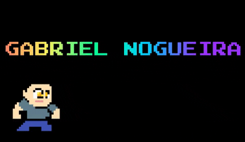

### Hello World! 👋

Technologist, majored in digital games by Fatec Carapicuíba, where I had the opportunity to do some monitoring in database. Currently I work as a Frontend developer. I have knowledge in several development technologies and programming languages with focus on web.

<h3 align="left">Languages and Tools:</h3>

        

<h3 align="left">Connect with me:</h3>

